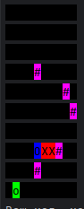

Разработайте игру, в которой вы убегаете от объектов искусственного интеллекта по квадратному полю.

Программа сгенерирует случайную карту с препятствиями. Как игрок, так и его враги расположены на карте случайным образом. Каждый элемент карты должен иметь определенный цвет.

Пример сгенерированной карты:

**Обозначения**:  
`o` - позиция игрока (пользователя программы) на карте. 
`#` - препятствие 
`x` - враг (искусственный интеллект) 
`O` - целевая точка, до которой игрок должен добраться до того, как враги доберутся до игрока. Считается, что игрок достиг целевой ячейки, если он наступил на ее позицию.

**Правила игры**:
1. Каждый участник (игрок и враги) может сделать один ход. Затем наступает очередь другого участника. Считается, что противник добрался до игрока, если он может занять позицию игрока, сделав текущий ход.
2. Доступные направления движения - влево, вправо, вниз и вверх.
3. Если враг не может двигаться вперед (вокруг него есть препятствия или другие враги, или достигнут край карты), враг пропускает ход.
4. Целевая точка является препятствием для врага.
5. Если игрок не может двигаться вперед (окружен препятствиями, врагами или достиг края карты), игрок проигрывает игру.
6. Игрок проигрывает, если враг находит его до того, как он достигнет целевой точки.
7. Игрок начинает игру первым.

**Требования к реализации**:
1. Размер поля, количество препятствий и количество врагов вводятся в программу с помощью параметров командной строки (их наличие гарантировано): 
   `$ java -jar target/Game-0.0.1-jar-with-dependencies.jar --size=10 --profile=production --enemiesCount=2 --wallsCount=5`
2. Необходимо проверить, возможно ли разместить указанное количество врагов и препятствий на карте заданного размера. Если входные данные неверны, программа выдаст непроверенное исключение IllegalParametersException и завершит работу.
3. Враги, препятствия, игрок и целевая точка располагаются на поле случайным образом.
4. При создании карты враги, игрок, препятствия и целевая точка не должны пересекаться.
5. В начале игры карта должна быть сгенерирована таким образом, чтобы игрок мог добраться до целевой точки (игрок не должен быть заблокирован стенами и краем карты в исходном положении).
6. Чтобы сделать ход, игрок должен ввести в консоль число, соответствующее направлению движения A, W, D, S (влево, вверх, вправо, вниз).
7. Если игрок не может сделать ход в указанном направлении, вводится другое число (направление).
8. Если в начале или середине игры игрок понимает, что целевая точка недостижима, он должен закончить игру, введя 9 (игрок проигрывает).
9. Как только игрок сделал ход, настает очередь его противника сделать ход в сторону игрока.
10. В режиме разработки игрок должен подтверждать каждый шаг противника, вводя 8.
11. На каждом шаге любого участника карта должна быть перерисована в консоли. В режиме разработки карта должна отображаться без обновления экрана.
12. Алгоритм выполнения должен учитывать местоположение целевого объекта на каждом шаге.

**Требования к архитектуре**:
1. Должны быть реализованы два проекта: Game (содержит логику игры, точку входа в приложение, функциональность вывода и т.д.) и ChaseLogic (содержит реализацию алгоритма преследования).
2. Оба являются проектами maven, и ChaseLogic должен быть добавлен в качестве зависимости к pom.xml inside Game.
3. Game.jar архив должен быть переносимым: JCommander и JCDP должны быть непосредственно включены в архив. В то же время все библиотеки, подключенные к проекту, должны быть объявлены как maven-зависимые. Для создания такого архива должны использоваться следующие плагины.

Также необходимо создать конфигурационный файл с именем application-production.properties. В этом файле вы укажете настройки вашего приложения. Пример этого файла показан ниже:

enemy.char = X  
player.char = o  
wall.char = \#  
goal.char = O  
empty.char=  
enemy.color = RED  
player.color = GREEN  
wall.color = MAGENTA  
goal.color = BLUE  
empty.color = YELLOW

Этот конфигурационный файл будет находиться в папке resources запущенного jar-архива.

В дополнение к этому должен быть реализован файл application-dev.properties. Структура этого файла аналогична структуре application.properties. Здесь вы можете указать параметры для различения запуска приложения в режиме разработки (например, разные цвета/символы для компонентов карты).

Необходимо иметь в виду, что программа может запускаться и в других режимах. Для этого в исходный проект может быть добавлен соответствующий файл свойств, а сам режим передается через параметр --profile.