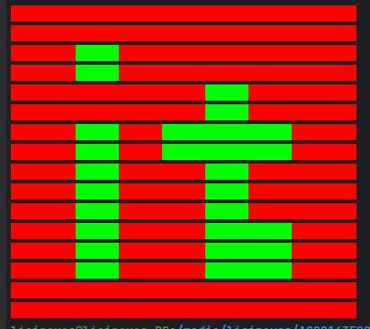

Необходимо реализовать функциональность, которая печатает двухцветное изображение в консоли.

Пример черно-белого BMP-изображения (этот формат обязателен для решения). Размер изображения 16*16 пикселей.

Архивы с этими библиотеками должны быть загружены и включены в проект предыдущей задачи.

Параметры запуска приложения должны быть обработаны средствами JCommander. Изображение должно отображаться с использованием опции вывода "colored" библиотеки JCDP.

Требуемая структура проекта:
- ImagesToChar - project folder
  - lib - папка внешней библиотеки
    - jcommander-*.**.jar
    - JCDP-*.*.*.jar/JCOLOR-*.*.*.jar
  - src - исходные файлы
    - java - файлы исходного кода Java
      - printer - серия основных пакетов
        - app - пакет, содержащий классы для запуска
        - logic - пакет, содержащий логику преобразования изображения в массив символов
  - target - скомпилированные файлы .class и архив
    - printer
    - com/beust ... - .class файлы библиотеки JCommander
    - com/diogonunes ... - .class файлы библиотеки JColor
  - resources
    - images-to-chars-printer.jar
  - README.txt

Мы должны получить приложение которая обрабатывает двухцветную картинку, находящуюся в ресурсах. При запуске архива задаются параметры двух цветов, на которые необходимо изменить картинку, и печатает новую картинку в консоль.

Пример работы программы:
`$ java -jar images-to-chars-printer.jar --white=RED --black=GREEN`

